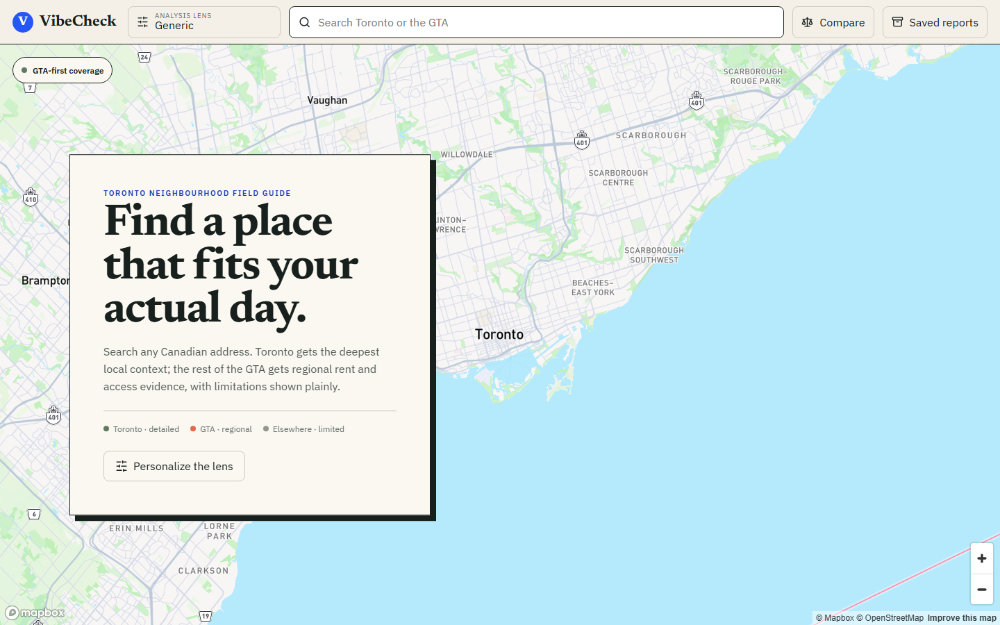
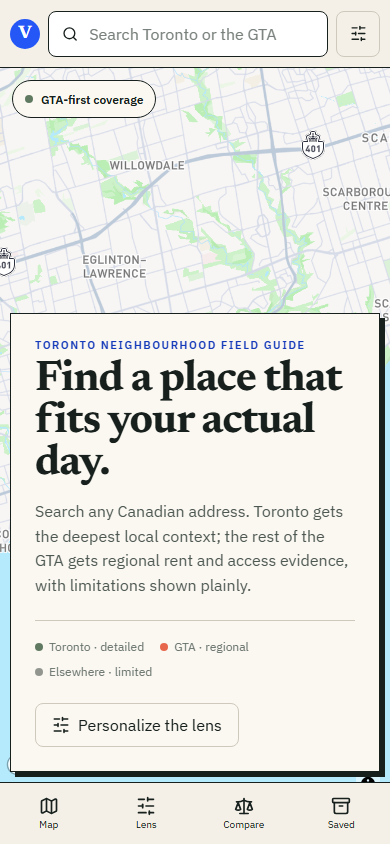

# VibeCheck

**An evidence-first Ontario neighbourhood field guide, built GTA-first.** Search an address, apply a personal lifestyle lens, and inspect exactly which public data supports the result.

[](https://github.com/Rahil2804/VibeCheck/actions/workflows/ci.yml)


---

## Demo

> **Demo video coming soon.** This space is reserved for a short walkthrough covering address search, preference lenses, evidence cards, comparison, and saved reports.

<!--
After uploading the demo video to GitHub, replace the note above with:

[<video src="vibecheck-demo.mp4" controls width="100%"></video>](https://github.com/user-attachments/assets/REPLACE_WITH_VIDEO_ID)

You can get the user-attachments URL by dragging the video into a GitHub issue or release description, then copying the generated URL without submitting the issue.
-->

<p align="center">
  
  
</p>

---

## Table of Contents

- [Overview](#overview)
- [Key Features](#key-features)
- [Architecture](#architecture)
- [Coverage and Data](#coverage-and-data)
- [Scoring and AI](#scoring-and-ai)
- [Tech Stack](#tech-stack)
- [Project Structure](#project-structure)
- [Getting Started](#getting-started)
- [Environment Variables](#environment-variables)
- [API Reference](#api-reference)
- [Refreshing the Snapshot](#refreshing-the-snapshot)
- [Testing](#testing)
- [Limitations and Guardrails](#limitations-and-guardrails)

---

## Overview

VibeCheck helps someone evaluate how well a neighbourhood matches the way they actually live. Instead of producing a mysterious all-purpose rating, it combines explicit preferences with source-backed evidence for transit, rent, cycling, everyday destinations, parks, local context, reported collisions, and eligible apartment-building records.

The central product rule is simple: **missing evidence stays unavailable**. It is never converted into a neutral-looking score.

### Core Flow

1. Search a Canadian address through Mapbox.
2. Use Generic mode or select a reusable preference lens.
3. Resolve the address to canonical Toronto/GTA geography.
4. Combine bundled official data with a cached OpenStreetMap neighbourhood query.
5. Calculate deterministic metrics, confidence, fit factors, and evidence checks.
6. Optionally use OpenAI to turn those accepted facts into cited prose.
7. Save, reopen, compare, refresh, or print the result without changing its original lens snapshot.

### Why “Ontario” and “GTA-first”?

“Ontario neighbourhood field guide” describes the product direction, while “GTA-first” states the current evidence boundary honestly. Toronto has the deepest official coverage, the rest of the GTA has strong regional coverage, and addresses elsewhere remain usable with visibly limited Mapbox/OpenStreetMap evidence. The interface never implies province-wide official coverage where it does not exist.

---

## Key Features

- **Preference-aware analysis** — Reusable lifestyle lenses support priorities, important signals, positive non-negotiables, rent ceilings, and unit size.
- **Transparent evidence** — Every metric can expose its source, geographic scope, edition, freshness, fallback state, and supporting fields.
- **Deterministic scoring** — Fit, coverage, availability, and confidence are computed before AI is considered.
- **Grounded AI narration** — OpenAI is optional, receives only supported facts, and cannot alter metrics or scoring.
- **Official GTA snapshot** — Versioned Statistics Canada, CMHC, GTFS, Toronto cycling, collision, and RentSafeTO data ships with the project.
- **Resilient OpenStreetMap access** — One shared Overpass query supplies access and fallback cycling context with endpoint failover and stale-cache support.
- **Saved and comparable reports** — Reports retain their original preference lens, analysis version, and snapshot ID.
- **Responsive portfolio interface** — Desktop and mobile layouts include keyboard-safe dialogs, print styles, accessibility checks, and a lazy-loaded map.

---

## Architecture

```text
┌──────────────────────────────────────────────────────────────┐
│                    React 19 + Vite Client                    │
│  Search · Map · Preference Lenses · Reports · Compare · PDF  │
└───────────────┬──────────────────────────────┬───────────────┘
                │ REST                         │ Mapbox GL JS
                ▼                              ▼
┌──────────────────────────────────────────────────────────────┐
│                       FastAPI Backend                        │
│ Geography · Evidence Pipeline · Scoring · Provenance · AI    │
└──────────┬─────────────────────┬────────────────────┬────────┘
           │                     │                    │
           ▼                     ▼                    ▼
┌──────────────────┐  ┌────────────────────┐  ┌────────────────┐
│ Bundled Snapshot │  │ Live OSM / Mapbox  │  │ Optional OpenAI│
│ GTFS · CMHC      │  │ Failover + Cache   │  │ Cited prose    │
│ Census · Toronto │  └──────────┬─────────┘  └────────────────┘
└──────────┬───────┘             │
           └──────────────┬──────┘
                          ▼
               ┌──────────────────────┐
               │ Local SQLite Storage │
               │ Profiles · Reports   │
               │ Source cache         │
               └──────────────────────┘
```

### Analysis Pipeline

```text
Address
  -> Mapbox place resolution
  -> canonical geography resolution
  -> snapshot and live-source collection
  -> evidence availability checks
  -> deterministic metrics and fit factors
  -> confidence and provenance
  -> optional evidence-cited AI narrative
  -> immutable saved report
```

The normalized snapshot is checked into `backend/snapshots/` and kept below 50 MB. Its manifest records source URLs, licences, retrieval dates, feed validity, partition freshness, checksums, and a stable snapshot ID.

---

## Coverage and Data

| Signal | Coverage | Evidence |
|---|---|---|
| Scheduled transit | GTA core systems | Regular-weekday GTFS for TTC, GO, UP Express, MiWay, Brampton Transit, YRT, and Durham Region Transit |
| Rent benchmark | GTA census subdivisions | CMHC 2025 purpose-built rents matched to studio, 1-bedroom, 2-bedroom, or 3-bedroom-plus preferences |
| Cycling | Any resolved address | Official Toronto network geometry; labelled OSM infrastructure estimate elsewhere or when the official partition is unavailable |
| Everyday access | Where OSM responds | Groceries, pharmacies, community amenities, dining, parks, and transit-stop fallback |
| Census context | GTA, with deeper Toronto detail | Statistics Canada 2021 census-subdivision context and Toronto's 158 neighbourhood profiles |
| Local context | Toronto | Toronto neighbourhood profiles, parks, cycling, and Bike Share station context |
| Reported collision history | Toronto | Latest five complete annual years plus separately reported daily KSI collisions within 1 km |
| Building record | Exact Toronto civic addresses | RentSafeTO registration and latest evaluation for an unambiguous exact address or official civic-number range |

### Coverage Tiers

| Region | Experience |
|---|---|
| **Toronto** | Full local and regional evidence, subject to source freshness and exact-address eligibility |
| **Rest of the GTA** | Regional Census, rent, scheduled transit, and OSM access/cycling context |
| **Outside the GTA** | Limited Mapbox/OSM analysis with an explicit coverage warning |

Official publishers include [Statistics Canada](https://www.statcan.gc.ca/en/developers), [CMHC](https://www.cmhc-schl.gc.ca/professionals/housing-markets-data-and-research/housing-data/data-tables/rental-market), [Metrolinx](https://www.metrolinx.com/en/about-us/open-data), municipal GTA transit agencies, [Toronto Open Data](https://open.toronto.ca/), and [OpenStreetMap contributors](https://www.openstreetmap.org/copyright).

---

## Scoring and AI

### Deterministic Scores

- **Scheduled transit** — Proximity 25%, peak frequency 40%, route diversity 25%, and rapid/regional access 10%.
- **Cycling** — `67 * min(protected_or_separated_km / 3, 1) + 33 * min(total_network_km / 5, 1)`, rounded to 0-100.
- **Walkability** — Everyday destinations, parks, dining/activity, and community amenities. Transit is excluded to prevent double-counting.
- **Rent fit** — Only the selected unit size's current CMHC purpose-built benchmark can affect a rent ceiling.
- **Preference fit** — Official evidence receives full factor strength; fallback OSM cycling evidence receives deliberately reduced influence.

A successful source query with no qualifying infrastructure can produce a real score of `0`. A failed or unsupported source produces `null`, is omitted from fit, and is shown as unavailable.

### Grounded AI

OpenAI is optional and writes prose only. Before an AI request is allowed, VibeCheck computes the evidence, scores, fit factors, confidence, coverage, and provenance deterministically.

The model receives an allowlisted JSON payload containing supported facts and active preferences. Generated claims must cite valid evidence-check IDs. Claims involving unsupported numbers, protected classes, crime/safety conclusions, noise, schools, sentiment, or development trajectory are rejected and replaced with deterministic copy.

Private notes, secrets, commute anchors, raw provider payloads, and unavailable values are never sent to the model.

---

## Tech Stack

| Layer | Technology | Purpose |
|---|---|---|
| Frontend | React 19, Vite 7 | Responsive single-page application and production build |
| Mapping | Mapbox GL JS 3 | Address search, basemap, markers, radius, and optional collision points |
| UI | Component-scoped CSS, Lucide React, Newsreader, IBM Plex Sans | Editorial field-guide interface and accessible controls |
| Backend | Python 3.12, FastAPI, Pydantic | Typed REST API, validation, orchestration, and migrations |
| Networking | HTTPX | Mapbox, OpenStreetMap, and official-source clients |
| Storage | SQLite | Preference profiles, saved reports, source cache, and bundled snapshot |
| Data pipeline | OpenPyXL, SQLite, official CSV/GeoJSON/GTFS | Snapshot download, normalization, validation, and atomic replacement |
| AI | OpenAI Responses API | Optional structured, evidence-cited narrative generation |
| Testing | Pytest, Node Test Runner, Vitest, React Testing Library | Backend, utility, reducer, and component coverage |
| Browser QA | Playwright, axe-core | Desktop/mobile flows, screenshots, keyboard behavior, and accessibility |
| CI | GitHub Actions, Ruff | Linux application gates, Windows snapshot checks, linting, and secret scanning |

---

## Project Structure

```text
VibeCheck/
├── backend/
│   ├── main.py                 # FastAPI routes
│   ├── pipeline.py             # Analysis orchestration
│   ├── models.py               # API and persistence models
│   ├── scorer.py               # Preference-fit factors
│   ├── evidence.py             # Evidence checks and availability
│   ├── synthesizer.py          # Optional grounded OpenAI narrative
│   ├── sources/                # Mapbox, OSM, Census, housing, transit, local data
│   └── snapshots/              # Versioned GTA SQLite artifact and manifest
├── frontend/
│   ├── src/
│   │   ├── components/         # Map, reports, profiles, compare, evidence UI
│   │   ├── hooks/              # Analysis-session and dialog behavior
│   │   └── utils/              # API, Mapbox, lens, comparison, freshness helpers
│   ├── e2e/                    # Playwright and axe scenarios
│   └── scripts/                # Documentation capture and bundle budget
├── scripts/
│   ├── refresh_gta_snapshot.py # Reproducible official-data builder
│   └── check_secrets.py        # Repository secret scan
├── tests/                      # Backend fixtures and regression tests
├── PLAN.md                     # Verified scope and deliberate deferrals
└── README.md
```

---

## Getting Started

### Prerequisites

- **Python 3.12+**
- **Node.js 22+** and npm
- A public **Mapbox token**
- An **OpenAI API key** only if you want AI-written prose

### 1. Clone the Repository

```powershell
git clone https://github.com/Rahil2804/VibeCheck.git
Set-Location VibeCheck
```

### 2. Set Up the Backend

```powershell
python -m venv .venv
.\.venv\Scripts\python.exe -m pip install -r requirements.txt
Copy-Item .env.example .env
.\.venv\Scripts\python.exe -m backend.doctor
.\.venv\Scripts\python.exe -m uvicorn backend.main:app --reload
```

The backend runs at `http://127.0.0.1:8000`.

### 3. Set Up the Frontend

Open a second terminal:

```powershell
Set-Location frontend
npm.cmd install
Copy-Item .env.example .env
npm.cmd run dev
```

Open `http://127.0.0.1:5173`.

Vite reads environment variables when it starts. Restart the frontend after changing `frontend/.env`. If the basemap is blank, confirm the frontend token and allow both `http://127.0.0.1:5173/*` and `http://localhost:5173/*` in its Mapbox URL restrictions.

---

## Environment Variables

### Backend — root `.env`

| Variable | Required | Purpose | Default |
|---|---:|---|---|
| `MAPBOX_TOKEN` | Yes | Server-side place resolution | — |
| `OPENAI_API_KEY` | No | Evidence-grounded narrative generation | Deterministic narrative |
| `OPENAI_MODEL` | When enabling AI | Responses API model ID available to your OpenAI project | — |
| `SOURCE_TIMEOUT_SECONDS` | No | Live-source timeout | `8` |
| `SQLITE_PATH` | No | Local application database | `data/vibecheck.db` |

OpenAI is optional. To enable AI-written narrative, set both `OPENAI_API_KEY` and `OPENAI_MODEL`; choose the model that fits your own quality, latency, access, and cost requirements. If either value is blank, VibeCheck uses its deterministic narrative instead. See the [official model-selection guide](https://developers.openai.com/api/docs/guides/model-selection) for current options.

### Frontend — `frontend/.env`

| Variable | Required | Purpose | Default |
|---|---:|---|---|
| `VITE_MAPBOX_TOKEN` | Yes | Browser map and address search | — |
| `VITE_API_BASE_URL` | No | FastAPI base URL | `http://127.0.0.1:8000` |

Never commit real tokens. If a key is exposed in a message, screenshot, log, or commit, revoke it before continuing.

---

## API Reference

| Method | Endpoint | Description |
|---|---|---|
| `GET` | `/health` | Secret-free Mapbox, snapshot, SQLite, OSM, and optional OpenAI configuration checks |
| `POST` | `/analyze` | Analyze an address using Generic mode, explicit preferences, or a saved lens |
| `GET` | `/preference-profiles` | List reusable preference lenses |
| `POST` | `/preference-profiles` | Create a preference lens |
| `GET` | `/preference-profiles/{id}` | Read a preference lens |
| `PUT` | `/preference-profiles/{id}` | Update a preference lens |
| `DELETE` | `/preference-profiles/{id}` | Delete a preference lens while preserving historical report snapshots |
| `POST` | `/preference-profiles/{id}/default` | Set the default lens |
| `GET` | `/profiles` | List saved report summaries |
| `POST` | `/profiles` | Save an analysis report |
| `GET` | `/profiles/{id}` | Open a saved report with its immutable lens snapshot |
| `POST` | `/profiles/{id}/refresh` | Refresh a saved report while preserving compatibility |
| `DELETE` | `/profiles/{id}` | Delete a saved report |

FastAPI also exposes interactive local API documentation at `http://127.0.0.1:8000/docs`.

---

## Refreshing the Snapshot

The checked-in artifact keeps normal analysis reproducible and avoids downloading large official workbooks or GTFS feeds during every request.

### Full Refresh

```powershell
.\.venv\Scripts\python.exe -m scripts.refresh_gta_snapshot
.\.venv\Scripts\python.exe -m backend.snapshot
```

### Toronto Collision and Building Partitions Only

```powershell
.\.venv\Scripts\python.exe -m scripts.refresh_gta_snapshot --only road-buildings
```

The builder stages files beside the final artifact, validates schema, checksums, SQLite integrity, required rows, agency feeds, and the 50 MB budget, then atomically replaces the previous snapshot. A failed refresh leaves the last valid artifact intact.

Live OSM results are cached for 24 hours. If both configured Overpass endpoints fail, a result up to seven days old may be returned with an explicit stale label.

---

## Testing

### Backend

```powershell
.\.venv\Scripts\ruff.exe check backend scripts tests
.\.venv\Scripts\python.exe -m scripts.check_secrets
.\.venv\Scripts\python.exe -m backend.snapshot
.\.venv\Scripts\python.exe -m pytest -q
```

### Frontend

```powershell
Set-Location frontend
npm.cmd test
npm.cmd run build
npm.cmd run check:bundle
npx.cmd playwright install chromium
npm.cmd run test:e2e
```

GitHub Actions runs linting, secret scanning, snapshot validation, backend and frontend tests, the production build, the initial-shell bundle budget, Playwright visual flows, axe accessibility checks, and Windows snapshot-readability tests.

---

## Limitations and Guardrails

- Scheduled transit is static; real-time arrivals and commute routing are not included.
- CMHC values are purpose-built market benchmarks, not live asking rents or exact-address listings.
- Some CMHC rows represent grouped reporting zones rather than one municipality; the interface displays the official scope.
- Recently expired or missing GTFS feeds are labelled stale and may use an OSM stop fallback.
- Toronto's 2021 renter shelter cost is historical household context, not a current asking-rent estimate.
- Collision evidence is Toronto-only reported history within 1 km. It is not a probability, safety score, causal claim, or future-risk estimate.
- RentSafeTO evaluates eligible registered apartment-building common areas and property standards, not individual units. No exact match does not prove a building is unregistered.
- OSM mapping completeness varies. Cycling measures mapped infrastructure length, not route quality, elevation, comfort, traffic stress, or safety.
- Live listings, Reddit, crime/policing rankings, schools, noise claims, permits/trajectory, flood risk, accounts, cloud sync, and public sharing are intentionally out of scope.

### Fair-Housing Rule

Fit uses explicit lifestyle preferences and neutral place evidence only. Age, income, race, religion, disability, family status, national origin, sex, and their proxies never affect neighbourhood recommendations.

---

## License

VibeCheck is available under the [MIT License](LICENSE).
